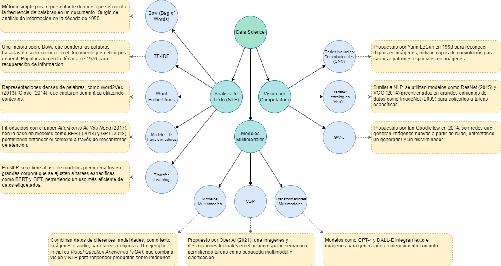

# A Multimodal Dataset of Fact-Checked News from Chile’s Constitutional Processes: Collection, Processing and Analysis

We aim to develop multimodal models to analyze visual fake news on social media in the context of Chile's two constitutional processes. This need arises within the development of a project focused on modeling multimodal narratives of fake news, which is the first part of a larger project that seeks to develop a computational framework based on multimodal narrative extraction techniques and advanced language models, also focused on fake news.

The first step to extract narratives from the data requires an appropriate embeddings model that can capture the information contained in visual fake news and calculate the similarity between these publications, which will allow us to recognize the credibility of each news item based solely on its characteristics.

## Getting Started

You need a version of **Python** equal to or greater than **3.11.9** ([download Python](https://www.python.org/downloads/)). Using **Visual Studio Code** is recommended.

1. Clone Project

   ```bash
   git clone https://github.com/MolodyGs/CapstoneProject.git
   ```

2. Create a Virtual Environment (if needed)

   ```bash
   python -m venv .venv
   .venv/Scripts/activate
   ```

3. Install Dependencies
   This procedure can take between 10 to 20 minutes depending on connectivity.
   ```bash
   pip install -r requirements.txt
   ```

## Usage

1. Get Pages - `get_pages.ipynb`
2. Text Model - `text_model.ipynb`
3. Text Extraction from Images - `text_extract_in_images.ipynb`
4. Hybrid Model - `hybrid_model.ipynb`
5. Multimodal Model - `multimodal_model.ipynb`

## Conceptual Map of Models (in Spanish)


